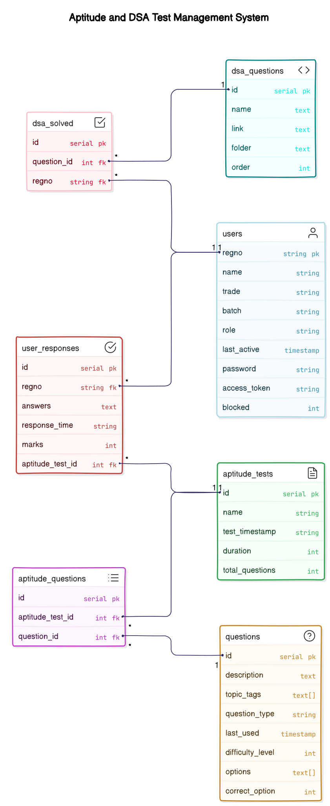

## STEPS TO SET UP
- Clone the Repo `git clone https://github.com/aphsavii/ppp-server.git`
- Install the dependencies `npm install`
- Create a .env file in the root of this repo with fields in .env-sample.txt
- Run the dev server `npm run dev`
- Open the browser and go to `http://localhost:3000/`

## ER Diagram

